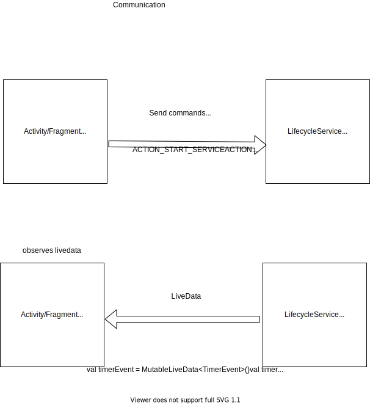

<p align="center">
  <a href="https://img.shields.io/badge/License-MIT-yellow.svg"></a>
  <a href="https://badges.frapsoft.com/os/v2/open-source.svg?v=103"></a>
</p>

# LifecycleService Demo 
Demo to show the usage of lifecycle service. Using stop watch timer as an example. As the timer gets started, there will be a foreground service which shows a notification with a current timer. I have used singleton pattern approach for service in order to observe live data values which is inside the service. 

## Communication Flow
Activity/Fragment communicates with TimerService by sending commands as actions like START and STOP service and depending on the action timer service starts to 
perform business logic and push their values to livedata. Those livedata properties are observed by MainActivity.
Here we are using two livedata properties. 
One is for observing time in milli seconds and the second one is to observer TimerEvent which has START and STOP events. Mainactivity observes them and it changes the UI according to the received event.
Livedata properties are available through TimerService companion object.

## Advantages
I felt like this is pretty clean and you can avoid binding our activity to our main activity because our job perfectly suits this scenario.
Due to livedata we don't need to worry about configuration changes like screen rotation. 

## Communication Diagram


##  Animated Gif 📷


## License
```
MIT License

Copyright (c) 2020 Sri Harsha Pothineni

Permission is hereby granted, free of charge, to any person obtaining a copy
of this software and associated documentation files (the "Software"), to deal
in the Software without restriction, including without limitation the rights
to use, copy, modify, merge, publish, distribute, sublicense, and/or sell
copies of the Software, and to permit persons to whom the Software is
furnished to do so, subject to the following conditions:

The above copyright notice and this permission notice shall be included in all
copies or substantial portions of the Software.

THE SOFTWARE IS PROVIDED "AS IS", WITHOUT WARRANTY OF ANY KIND, EXPRESS OR
IMPLIED, INCLUDING BUT NOT LIMITED TO THE WARRANTIES OF MERCHANTABILITY,
FITNESS FOR A PARTICULAR PURPOSE AND NONINFRINGEMENT. IN NO EVENT SHALL THE
AUTHORS OR COPYRIGHT HOLDERS BE LIABLE FOR ANY CLAIM, DAMAGES OR OTHER
LIABILITY, WHETHER IN AN ACTION OF CONTRACT, TORT OR OTHERWISE, ARISING FROM,
OUT OF OR IN CONNECTION WITH THE SOFTWARE OR THE USE OR OTHER DEALINGS IN THE
SOFTWARE.
```
